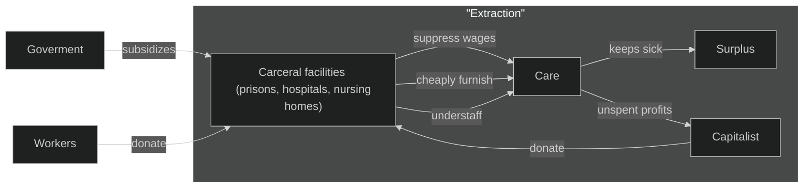
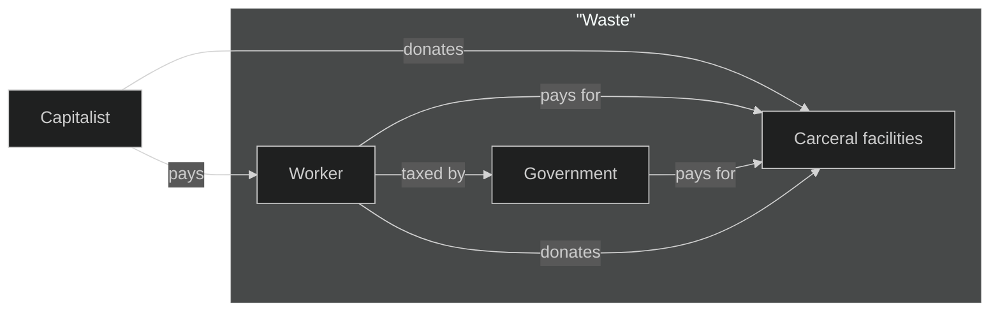
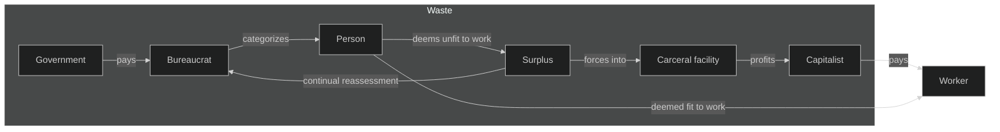

Nashville Tenant Union's

# <!--fit--> Health of the Union

Debunking the eugenics that divide us.

(Work in Progress)

---

# Our Sources

1. Health Communism
    - Beatrice Adler-Bolton & Artie Verkant
2. Mutual Aid
    - Dean Spade

---

# Health Communism

* What are the problems of public health under capitalism?
* What are the solutions?
* How does health factor into revolution?

---

# Surplus

* Populations marked for “extractive abandonment”
* Made profitable for capital

---

---

# Waste

* Intentional waste of resources in order to argue that surplus populations are a societal burden
  * Eugenic burden
  * Debt burden

---

# Labor

* Surplus populations are separated from labor based on relation to capital

---

# Madness

* The asylum system separates surplus from the working class
* Preyed upon by capital for extraction

---

# Pharmacology

* The pharmaceutical industry has been used to create imperialist trade policies
* Resistance through organizing
    * ACT UP
    * Treatment Action Group (TAG)

---

# Border

* Imperial core develops private health industries
    * Periphery is forced to privatize their national healthcare solutions

---

# Care

* SPK (Sozialistisches Patientenkollektiv) was formed to offer an alternative to the capitalist West German state.
    * radical patients' group in the 1970s

---

# Cure

* SPK was demonized by those in power to prevent their influence and erase their history

---

# Host

* Capitalism can only be defeated by a movement that centers surplus populations
    * Eugenic and debt ideologies must be resisted

---

# Deep Dive #1

## Separation and Myths

Surplus populations and the concept of "waste"

---

# What is Surplus?

A population that falls outside of normative social and economic State policies.

---

<!--
_header: 'What is Surplus?'
-->

* Cannot be rigidly defined 
    * policies change over time
    * varies based on political geography

---

<!--
_header: 'What is Surplus?'
-->

* Threat to capital
    * Removing this division builds solidarity
        * Increases union power
    * Reduce profits (a.k.a. stolen wages)
        * The profits are artificially high due to the creation of a surplus population

---

# Treatment of Surplus

"Organized Abandonment"

* deliberate manipulation and dispossession of resources from Black, Brown, Indigenous, disabled, and poor communities
* more vulnerable to adverse health
* social value is considered "as good as dead"
    * popularly considered "waste"

<!-- Ruth Wilson Gilmore coined this phrase. -->

---

<!--
_header: 'Treatment of Surplus'
-->

"Extraction"

> Surplus populations are spun into gold. Disability is commodified through [a] matrix of incarceration (prisons, hospitals, nursing homes).

~ Jasbir Puar

---

<!--
_header: 'Treatment of Surplus'
-->

Our society funds a carceral care system that primarily benefits capitalists.

---

<!--
_header: 'Treatment of Surplus'
-->

---

# What is Waste?

Popular eugenic narratives depict the surplus population as "wasting resources".

---

<!--
_header: 'What is Waste?'
-->

The popularized myth of "waste".

---

<!--
_header: 'What is Waste?'
-->

Waste is actually in the bureaucratic system that judges who is surplus and unnecessarily expands carceral care.

---